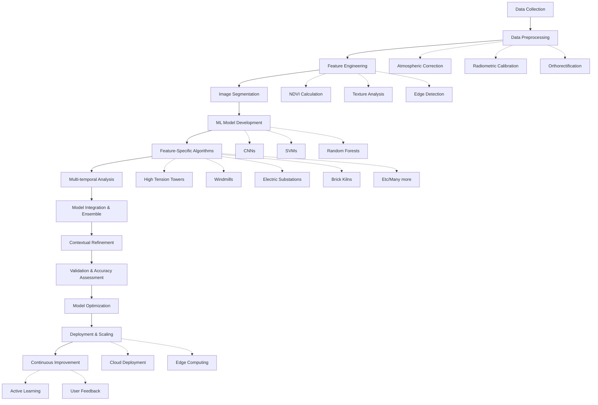

# Goofy-HighRes-ML


# Feature Extraction from Remote Sensing High Resolution Data using AI/ML

## Project Overview

This project aims to develop an advanced feature extraction system for high-resolution remote sensing data, focusing on identifying and mapping key infrastructure elements across diverse Indian landscapes. The system utilizes state-of-the-art AI and ML techniques to extract features such as ex-high tension towers, windmills, electric substations, brick kilns, and farmbunds.

## Table of Contents

1. [Project Goals](#project-goals)
2. [Data Sources](#data-sources)
3. [Methodology](#methodology)
4. [Key Technologies](#key-technologies)
5. [Project Structure](#project-structure)
6. [Installation](#installation)
7. [Flowchart](#Flowchart)
8. [Contributing](#contributing)
9. [License](#license)

## Project Goals

- Develop a robust feature extraction pipeline for high-resolution remote sensing data
- Implement advanced AI/ML techniques for accurate identification of infrastructure elements
- Create a scalable solution adaptable to various Indian landscapes
- Integrate multi-source data for comprehensive analysis
- Provide a user-friendly interface for ISRO scientists and researchers

## Data Sources

- High-resolution satellite imagery
- Multi-spectral data (visible, near-infrared, thermal bands)
- Synthetic Aperture Radar (SAR) data
- Light Detection and Ranging (LiDAR) data
- Digital Elevation Models (DEMs)
- Ground truth data from field surveys and existing GIS databases

## Methodology

1. Data Collection and Preprocessing
2. Feature Engineering
3. Image Segmentation
4. Machine Learning Model Development
5. Feature-Specific Algorithm Implementation
6. Multi-temporal Analysis
7. Model Integration and Ensemble
8. Contextual Refinement
9. Validation and Accuracy Assessment
10. Model Optimization
11. Deployment and Scaling
12. Continuous Improvement

## Key Technologies

- Convolutional Neural Networks (CNNs)
- Object-Based Image Analysis (OBIA)
- Support Vector Machines (SVMs)
- Random Forests
- Deep Learning frameworks (TensorFlow, PyTorch)
- Geographic Information Systems (GIS)
- Cloud Computing platforms
- Distributed Computing frameworks (Apache Spark)

## Project Structure

```
feature-extraction/
│
├── data/
│   ├── raw/
│   ├── processed/
│   └── external/
│
├── models/
│   ├── cnn/
│   ├── svm/
│   └── ensemble/
│
├── src/
│   ├── data_processing/
│   ├── feature_engineering/
│   ├── model_training/
│   └── evaluation/
│
├── notebooks/
│
├── tests/
│
├── docs/
│
├── config/
│
├── requirements.txt
│
└── README.md
```
## Flowchart




## Installation

```bash
git clone https://github.com/your-org/feature-extraction.git
cd feature-extraction
pip install -r requirements.txt
```


## Contributing

We welcome contributions from the scientific community. Please refer to our contributing guidelines for more information.

## License

[Specify the license under which this project is released]

---

For more information, please contact the ISRO Remote Sensing Department.
```

This README provides a comprehensive overview of the project, its goals, methodology, and structure. It serves as a starting point for anyone looking to understand or contribute to the project. You may want to customize it further based on specific ISRO guidelines or add more detailed information about the implementation and usage of the system.
