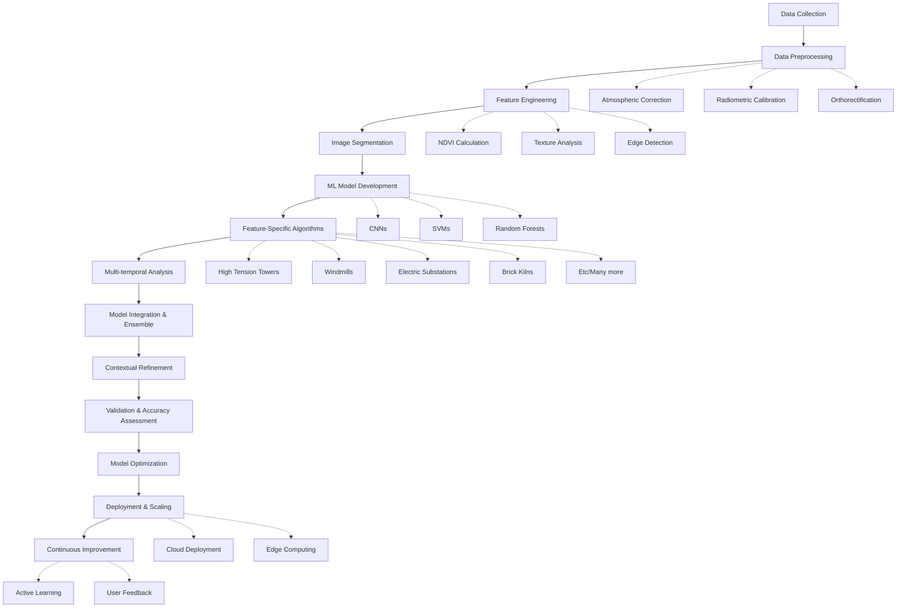

# Project Ideation: Advanced Feature Extraction from High-Resolution Remote Sensing Data

## Team Name: GeoVision Innovators

## Name of College(s)/University(s): 
Indian Institute Of Technology Madras

## Team Members Details:
1. Team Member-1: [Nimish Shinde], [Role/Expertise]
2. Team Member-2: [Arka Dash], [Role/Expertise]
3. Team Member-3: [Ruchir Kalokhe], [Role/Expertise]
4. Team Member-4: [Suresh], [Role/Expertise]

## Detailed Solution and Approach (250-300 words)

Our solution proposes an innovative, multi-faceted approach to extract features such as ex-high tension towers, windmills, electric substations, brick kilns, and farmbunds from high-resolution remote sensing data in the Indian context. The core of our approach lies in combining advanced machine learning techniques with domain-specific algorithms tailored to each feature type.

We start with comprehensive data collection, including multi-spectral imagery, SAR, and LiDAR data when available. Our preprocessing pipeline ensures data quality through atmospheric correction, radiometric calibration, and co-registration of multi-source data.

The feature engineering phase leverages both traditional remote sensing indices and advanced texture analysis techniques. We employ multi-resolution segmentation to create object primitives, allowing for efficient and accurate feature identification.

Our machine learning model integrates both traditional classifiers (e.g., Random Forests, SVM) and deep learning architectures (e.g., U-Net, Mask R-CNN) to achieve robust feature detection. We've developed feature-specific algorithms, such as line detection for ex-high tension towers and circular Hough transform for windmills, to enhance accuracy.

A key innovation is our multi-temporal analysis component, which uses LSTMs to differentiate between seasonal changes and infrastructure modifications. This is crucial for monitoring dynamic landscapes in India.

We've also implemented contextual refinement using GIS data and spatial relationship analysis, significantly reducing false positives. Our solution includes a cloud-based processing pipeline for scalability and an active learning system for continuous improvement.

## Tools and Technology Used (50 words)

Python, TensorFlow, PyTorch, GDAL, scikit-learn, OpenCV, QGIS, Google Earth Engine, Apache Spark, Docker, Kubernetes, AWS/Azure Cloud Services, PostgreSQL/PostGIS, Jupyter Notebooks, Git for version control, and custom-built deep learning models and feature extraction algorithms.

## Opportunity
### How different is it from any of the other existing ideas?
Our solution differs from existing approaches in several key ways:
1. Integration of multi-source data (optical, SAR, LiDAR) for comprehensive feature analysis
3. Advanced multi-temporal analysis for dynamic landscape monitoring
4. Contextual refinement using GIS data and spatial relationships
5. Scalable cloud-based architecture with active learning for continuous improvement

### How will it be able to solve the problem?
Our solution addresses the challenge of extracting diverse infrastructure features from complex Indian landscapes by:
1. Leveraging multi-spectral and multi-temporal data for robust feature identification
2. Employing advanced ML techniques to handle variations in feature appearance and context
3. Utilizing domain-specific algorithms to capture unique characteristics of each feature type
4. Implementing contextual analysis to reduce false positives and improve accuracy
5. Providing a scalable, automated system for processing large volumes of satellite imagery

### USP of the proposed solution
1. Tailored to Indian landscape and infrastructure characteristics
2. Multi-temporal analysis for change detection and monitoring
3. Integration of traditional ML, deep learning, and domain-specific algorithms
4. Scalable cloud-based architecture for processing massive datasets
5. Active learning system for continuous improvement and adaptation to new data

## Proposed Architecture/User Diagram

[Insert a high-level architecture diagram here showing data flow from input imagery through preprocessing, feature extraction, ML models, to final output and user interface]

## List of Features Offered by the Solution
1. Automated extraction of ex-high tension towers, windmills, electric substations, brick kilns, and farmbunds
2. Multi-temporal change detection and monitoring
3. Integration with existing GIS systems
4. Cloud-based processing for large-scale feature extraction
5. User-friendly interface for result visualization and validation
6. Active learning system for model improvement
7. API for integration with other ISRO systems
8. Customizable feature detection modules for future expansion
9. Confidence scoring for extracted features
10. Geospatial analytics dashboard for trend analysis and reporting

## Process Flow Diagram

## Wireframes/Mock Diagrams of the Proposed Solution (optional)

[Wireframe Diagram: Main Dashboard](goofywebpage.pdf)

## Solution Brief (Overall)

Our advanced feature extraction system leverages cutting-edge machine learning techniques and domain-specific algorithms to accurately identify and monitor critical infrastructure elements in high-resolution satellite imagery. By combining multi-source data, temporal analysis, and contextual refinement, we provide a robust, scalable solution tailored to the unique challenges of Indian landscapes. Our system not only automates the extraction process but also enables continuous improvement through active learning, setting a new standard for geospatial intelligence in infrastructure monitoring and urban planning.
